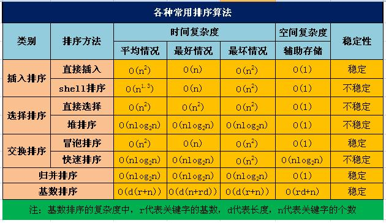

# zfliu-sort
就像汽水里的泡泡，会靠着自己的力量，慢慢升起，没有事情可以阻止你......
###八大排序

###排序算法有8种：
####插入排序：直接插入，希尔排序
####选择排序：简单选择，堆排序
####交换排序：冒泡排序，快速排序
####归并排序
####基数排序
##1.关于稳定性：
不稳定：快选堆希（快速排序、选择排序、堆排序、希尔排序）
稳    定：插冒归计基（简单插入排序、冒泡排序、归并排序、计数排序、基数排序）

##2.关于移动次数和关键字顺序无关的排序
顺口溜：一堆（堆排序）海龟（归并排序）选（选择排序）基（基数排序）友
